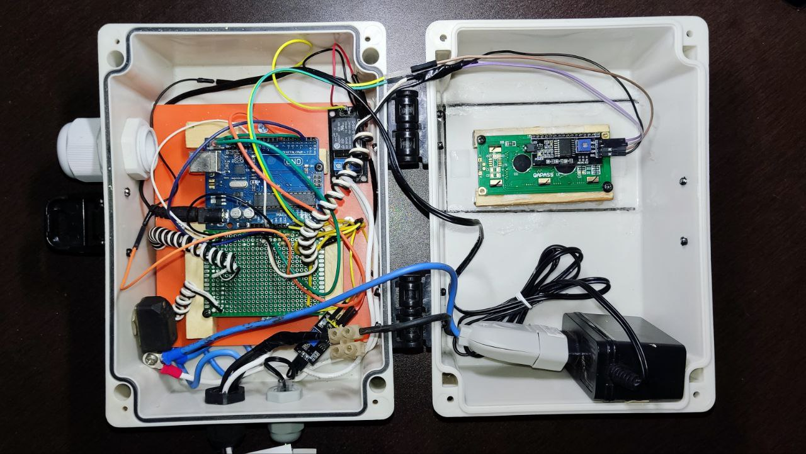

# Vgarden automation

Projeto de automação para irrigação de horta de alface. 

## 🚀 Descrição

Projeto de automação para irrigação de horta de alface, desenvolvido utilizando placa arduino uno r3, sensor de umidade de solo, relê para acionamento de carga e válvula solenoide.
O objetivo do sistema é identificar o estado do solo, realizando frequentes leituras pelo sensor e acionando a irrigação automaticamente quando necessário.
Através da automatização da irrigação é possível manter o solo mais próximo do ideal, auxiliar o processo de cultivo e otimizar o consumo de água. 

---
[Linkedin](https://www.linkedin.com/in/wellitonfernandes/) 😊