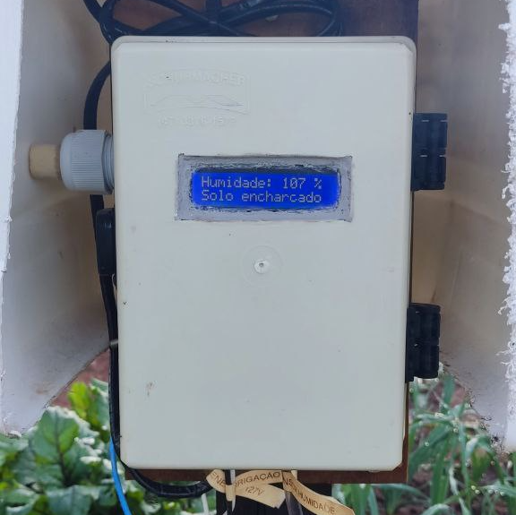

# Vgarden automation

Projeto de automação para irrigação de horta de alface. 

## 🚀 Descrição

Projeto de automação para irrigação de horta de alface, desenvolvido utilizando placa arduino uno r3, sensor de umidade de solo, relê para acionamento de carga e válvula solenoide.
O objetivo do sistema é identificar o estado do solo, realizando frequentes leituras pelo sensor e acionando a irrigação automaticamente quando necessário.
Através da automatização da irrigação é possível manter o solo mais próximo do ideal, auxiliar o processo de cultivo e otimizar o consumo de água.

## 📺 Vídeos do projeto

* [Teste dos aspersores, distribuição da água e humidade do solo](https://youtu.be/WjZSeHNa3O4)

## 🛠 Materiais utilizados

* 1 Caixa hermética 200mm x 140mm x 90mm
* 1 Arduino Uno R3
* 1 Módulo display lcd 16 x 2 com fundo azul e módulo i2c integrado 5V
* 1 Módulo Relê 5V para acionamento de carga
* 1 Sensor de umidade de solo resistente a corrosão com tensão de funcionamento dc 3.3v a 12V, corrente de trabalho de <20ma e corrente de saída de <30ma
* 1 Fonte de alimentação 12V 2A
* 1 Placa PCB 5x7 para circuito eletrônico
* 1 Válvula solenoide 127V com suporte e simples entrada de água ou 1 bomba d’água periférica BP500 127V com potência do Motor de ½ HP (a instalação da bomba deve ser acima ou no mesmo nível da água)
* 1 Contator TOMZN TOCT1-25 110V de 25A (2 polos normalmente abertos) **necessário somente caso utilize a bomba d’água**
* 1 Dispositivo de proteção EPS 301 bivolt
* 1 Chave alavanca liga/desliga com corrente de trabalho 6A em 125VAC e 3A em 250VAC
* x Metros de fios flexivél de 1,5mm para instalação interna, chicote para conexão de energia e acionamento da válvula solenoide
* 1 Chapa pequena de acrílico de 2mm ou maior
* 1 Tubo de silicone para vedação do visor
* 1 Plug de tomada macho 10A para conexão de energia
* 1 Plug de tomada fêmea 10A para conexão da fonte 12V
* x Metros de fita adesiva duplaface
* 2 Prensa cabo nylon 1/4
* 1 Prensa cabo nylon 3/4
* 4 Aspersores para irrigação

## ⚙️ Instalação do equipamento

- [x] O sensor de umidade deve ser instalado próximo a horta em uma profundidade de 0,15 metros
- [x] Os aspersores simples devem ser instalados respeitando a distância do espaçamento máximo recomendado (exemplo: 12x12 / 18x18), distribuídos de acordo com o raio de ação de irrigação
- [x] Manter a irrigação ativa durante todo o período de cúltivo, para uma melhor eficiência e desenvolvimento da plantação
  
---
[Linkedin](https://www.linkedin.com/in/wellitonfernandes/) 😊